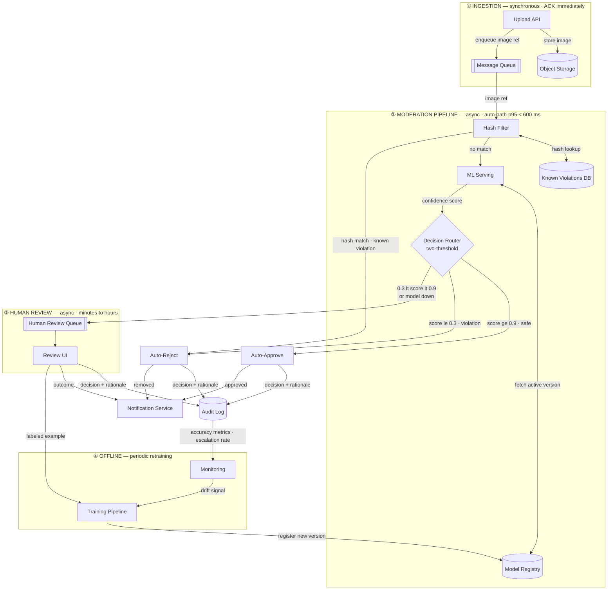

# Architecture — Image Moderation Pipeline (Scenario C)

> **Note on layout:** Mermaid's auto-layout algorithm struggles with graphs that combine multiple subgraphs and cross-boundary feedback loops. The feedback path from Training Pipeline back to Model Registry (inside the pipeline subgraph) creates a crossing that forces the layout to sprawl. The diagram is architecturally correct - all components, contracts, and serving boundaries are as intended. A tool like draw.io or Excalidraw would allow manual placement for a cleaner visual, at the cost of version control.